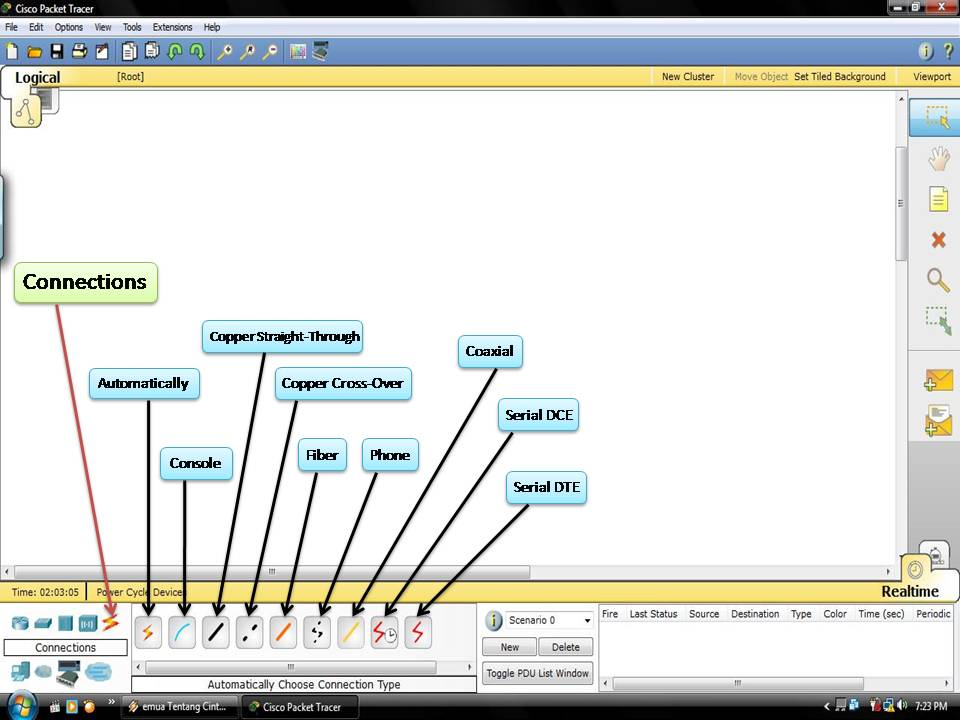
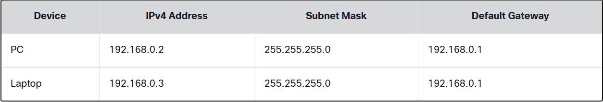

## Intro to Packet Tracer

#### UI

- 3 Main Menus
    - add devices & connect them via wireless or cables
    - select, delete, inspect, label, and group components within network
    - manage network
- Network management menu
    - open existing/sample network
    - save current network
    - modify user/preferences

- Wired card (in laptop): type of wired adapter used for connecting a laptop to the internet using a cellular network.

### 1.1.3

- Packet Tracer also has tabs for device config (tabs shown depend on device being configured):
    - physical: Interacting with device like powering it on or off or installing modules like wireless network interface card (NIC)
        - `(WNIC) - network interface controller that connects to a wireless network as opposed to wired`
    - Config: 2 ways to access intermediate device configurations like routers/switches. Can go to Config Tab (GUI) or use a CLI command
        - Config tab doesn't simulate functionality of device. As changes are made here equivalent CLI commands appear in Equivalent IOS Commands window. (Helps Learn)
    - CLI: Provides access to CLI of device. Need to know device config with IOS. Can practice config CISCO devices at CL. 
        - Internetwork Operating System is OS that runs on most CISCO routers & switches.
    - Desktop: For some devices can get access to IP config, wireless config, command prompt, web browser, etc. 
    - Services: Server has all functions of a host with addition of services tab. Allows Server to be configured with server processes like HTTP, DHCP, DNS, FTP, etc. 

### 2.0.1 CISCO Packet Tracer File Types

- .pka - PT activity file. Has instructions and is normally scored. 
    - Contains both initial and answer network
- .pkt - created when a simulated network is built in PT and saved. No instructions/scoring
- .pksz - PT Tutored Activity. Has media assets and hints. 
- .pkz - used to be used to imbed, now deprecated. 

### 2.1.1 

- 2 different devices use a straight through cable
- 2 like devices can use a `crossover cable` but it can vary
- i.e. 2 switches:
    - crossover, connect from one Gigabit port to another (Gig0/1 to Gig0/1)
- switch to router -> Connect at Gigabit ports
- PC to Router: Console cable 
    - PC RS232 port to Router Console port
    - Can manage router from PC CLI now  

- A `cable modem` is a hardware device that allows communications with an Internet Service Provider (ISP). 
    - Coaxial cable from ISP is connected to cable modem, ethernet cable from local network is also connected. 
    - Cable modem converts coaxial connection to ethernet connection

### 2.1.2  Packet Tracer Pka Creating a Simple Network

- `DHCP` stands for `dynamic host configuration protocol`.
    - Assigns IP addresses to devices dynamically
    - In example .pka Wireless Router is configured to assign IP addresses to device that put in request
    - If DHCP is disabled have assign IPs and configure all necessary info manually to communicate w/ rest of network
- `IPv4` or `Internet Protocol Vers. 4` address is a string of numbers in the form of x.x.x.x
-As internet got bigger we needed more IP addresses which is where IPv6 comes in. (More on IPv6 later)

- For this chart:
    - The IP addresses for the end devices can range from 192.168.0.2 to 192.168.0.254
    - Each NIC (network interface card) will get a unique IP address in the same network.

The `subnet mask` is used to differentiate the host and the network ID portion of the IP address.

- `IP=street address, subnet=defines length of street name`
- Network part of address is your street, 198.168.0.
- House number is host port of IP address
    - Ex: 192.168.0.2 -> house number is 2 and street number is 192.168.0
    - If there is another house on the street it might be 192.168.0.3
    - Max number of houses on street is 253 (from 2 to 254)
- `Default gateway` is street intersection
- Traffic from 198.168.0 has to go through intersection to go to another street (network). 
- In that network the `default gateway is the wireless router that directs traffic from local network to cable modem, and then to the ISP.`

