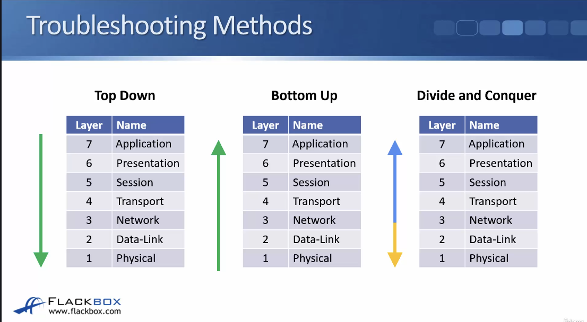
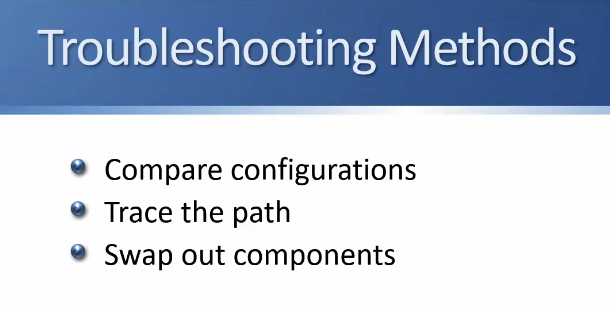
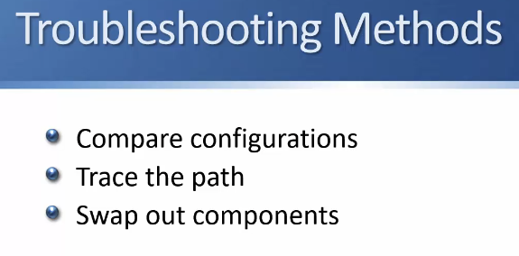
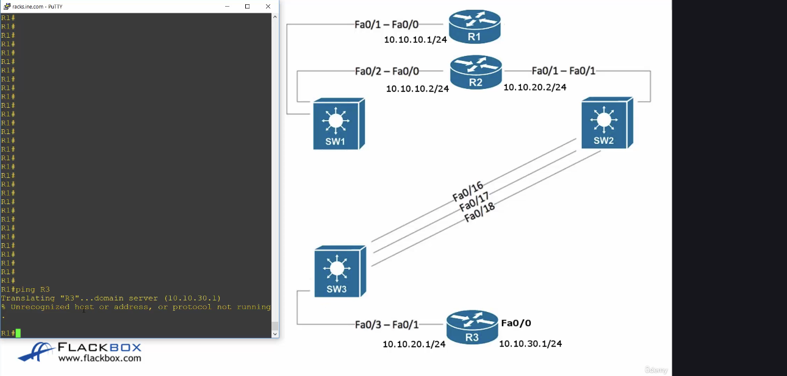
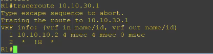
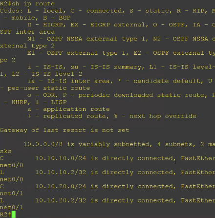
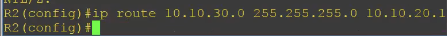
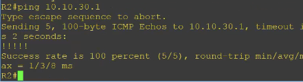
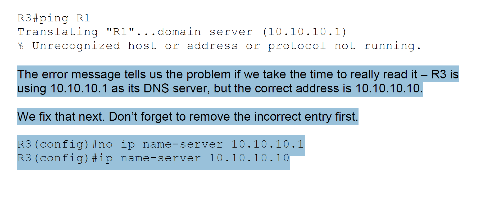

## Section 13 - The Cisco Troubleshooting Methodology

### The Cisco Troubleshooting Methodology - S13V76

### Cisco Troubleshooting Method - Lab Example S13V77

- User on PC behind R1 router complains DNS isn't working
- DNS Server is on R3 router

1. Check the actual problem to make sure it's not a user error

- it isn't reachable

2. Do a traceroute

- problem seems to be at R2 so lets look over there now

3. Go onto R2 and try to ping R3

4. Check R3 routing table 

- no route to 10.10.30.1 

5. Add route to 10.10.30.0

6. Try to ping again, ping works

- ping & traceroute help with Layer 3 (Network) issues
- telnet helps with Layer 4 (Transport) issues

- Tells us if DNS (port 53) is running on R3
    - if it wasn't open it would mean that the service isn't running at that destination

