## Section 15 - Cisco Device Management

### The Boot Up Process S15V88

- Flash on newer devices is removable card, older is in a chassis

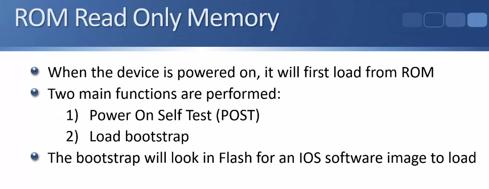

- If an IOS image can't be found in flash then the device will show the ROMMON prompt at the command line.
    - Can be used to recover a missing or corrupted software image - can boot from USB or an external Trivial File Transfer Protocol (TFTP) server to recover device

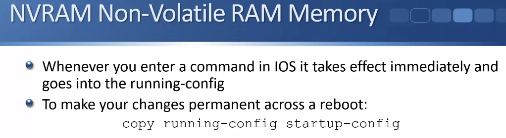

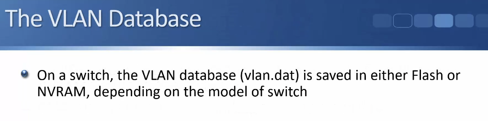

### Boot Up Process Lab Demo S15V89

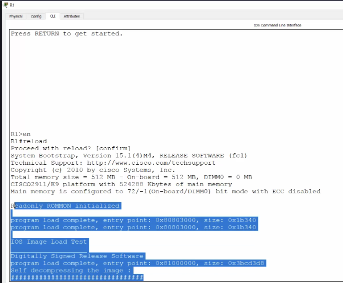
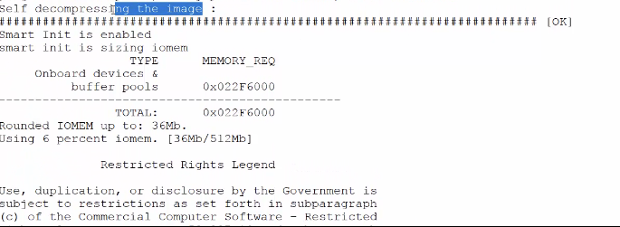

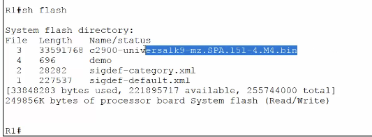

- ^only 1 system image

- still works while running since it's using RAM while running

- ^problem comes when you try to boot up again

Recover System Image:

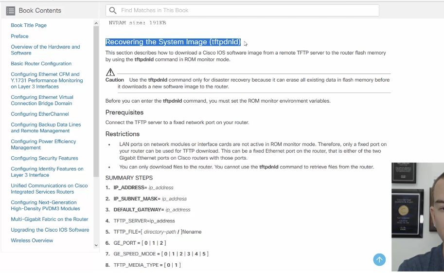

Since startup-config isn't loaded need to configure ip connectivity at rommon prompt:

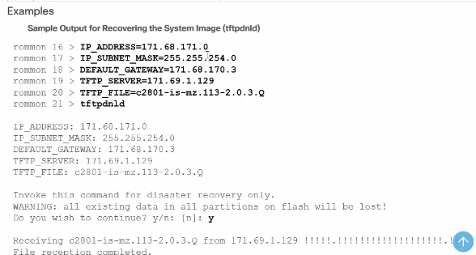

- ^if router is on same subnet as TFTP server just put the TFTP (Trivial File Transfer Protocol) server's ip down for default gateway

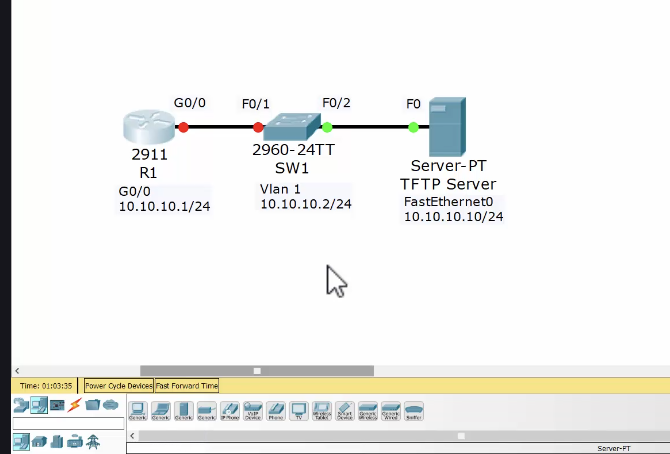

- ^already IOS system images on the TFTP server 
    - In the real world can download a free TFTP server, or use a paid one

### Factory Reset and Password Recovery S15V90

#### Factory Reset

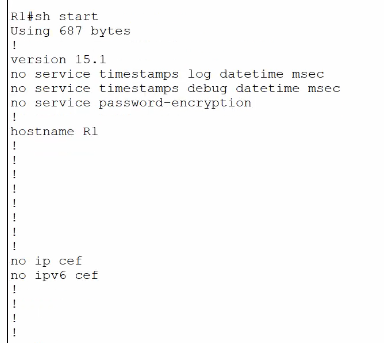

- ^hostname is R1 in running/startup config

Just change name in running: 

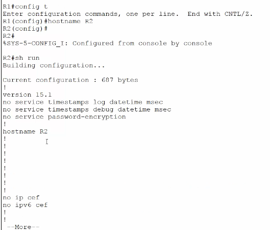

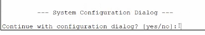

#### Password Recovery 

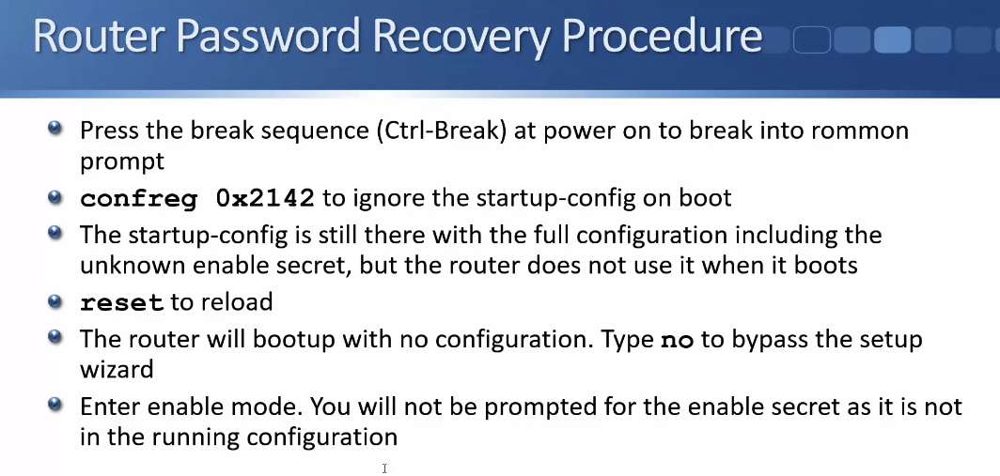

- ^When you've lost the enable prompt password

- important to copy into running config
- important to copy-register 0x2102 so router will not booth like a factory reset next time

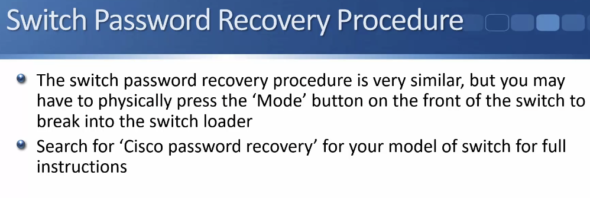

### Password Recovery Lab Demo S15V91

- recovering from a lost enable password or sec ret

- Save a running config: `copy running-config startup-config`

- secret is encrypted password is not
    - secret overrides password

1. Boot Router into rommon mode with 'Ctrl + Break'
    - do it from normal config (can't actually do it irl)

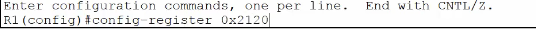

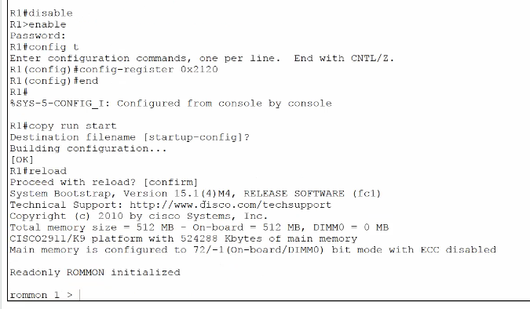

2. Once in rommon mode we need to tell the router to bypass startup-config while booting 

3. Set new enable secret or remove

4. Copy running config

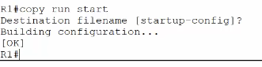

5. In global config reset the register

6. reload again to double-check that it works

**it didn't for this lab??**

- Why: It was originally an 'enable password' and we did 'disable secret' so it's still asking for a password.
    - You would normally add a secret so that wouldn't happen

### Backing up System Image and Configuration S15V92

- helps if you don't want to download it again later
- Backup config helps if you want to rollback
- Can't just copy into running config because they will merge

Steps:

1. Factory reset

2. Take copy of config file (`copy flash tftp` `copy running-config tftp`, etc)

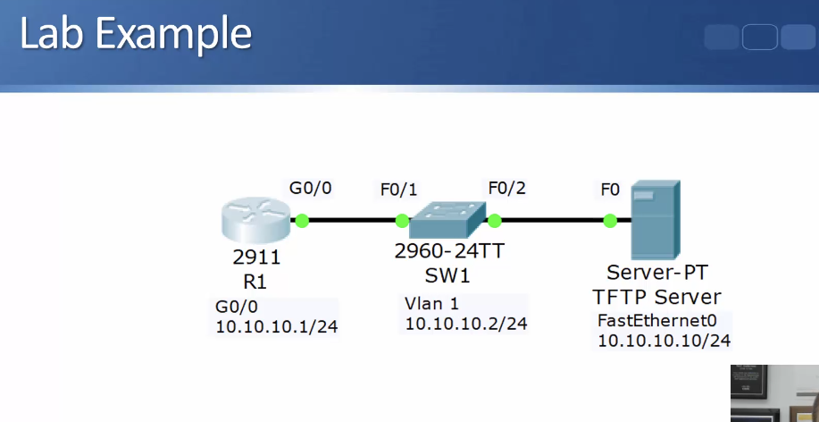

1. Back up system image and running config to TFTP server 

    - Check system image name
    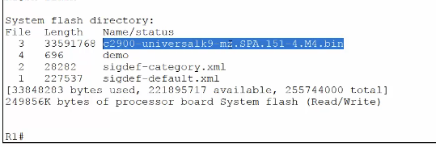

    - Make sure it's not already on TFTP (Trivial File Transfer Protocol) server (it's not)
    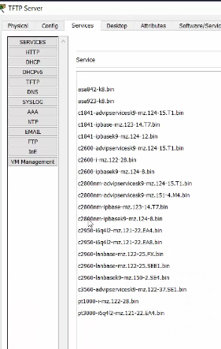

On router

2. Take a backup to flash then restore it

Router: 

None Yet, copy running config (useful in lab or test environment)
    - Lab: 
        1. Save startup config to flash, do lab exercises
        2. To get back to original startup config do `write erase` 
        3. then `show flash` 
        4. then `copy flash start` with the flash file you saved
        5. Reload
         

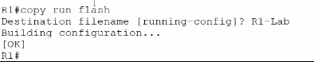

### Upgrading IOS S15V93

1. Get new software image
    
2. copy to device's flash using tftp
3. delete old image or use boot system command 

Check current:

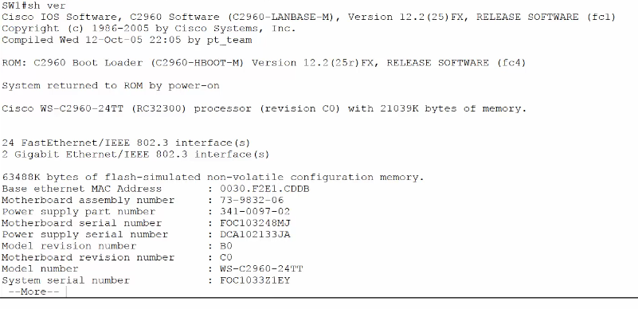

Upgrade to new:

See new one in TFTP:

TFTP server is at 10.10.10.10 want to keep same name:

- Now we're gonna keep the old one jic 

- do boot system flash command now it should be good: 

- When system boots up it loads image into RAM so we need to reload the new system image:

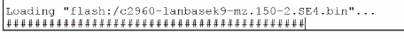

Both images are still there: 

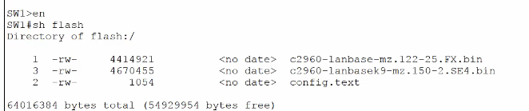

Now we're running 15.0: 

 