## Section 17

### Dynamic Routing Protocols vs Static RoutesS17V105

#### Propagate Routes from right to left

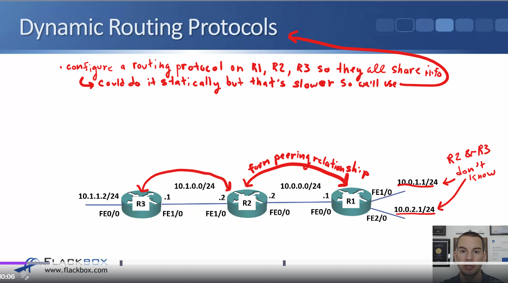

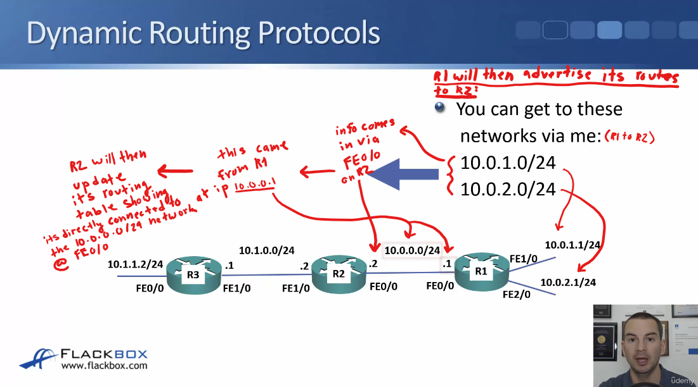

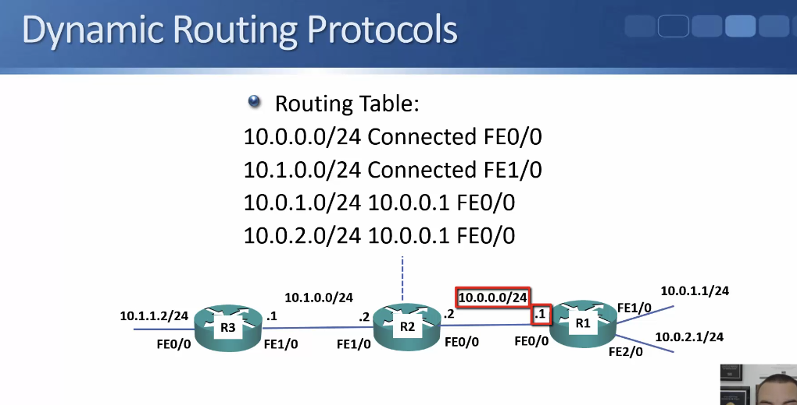

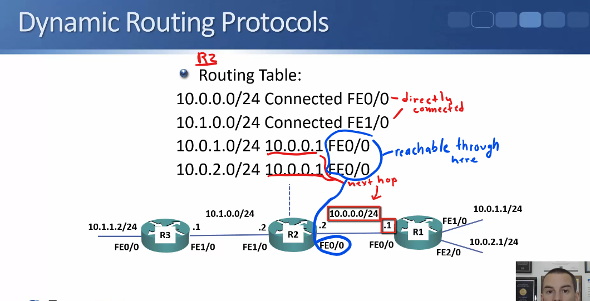

#### From Left to right:

- same thing as before just from other side

#### Summary Routes S17V10

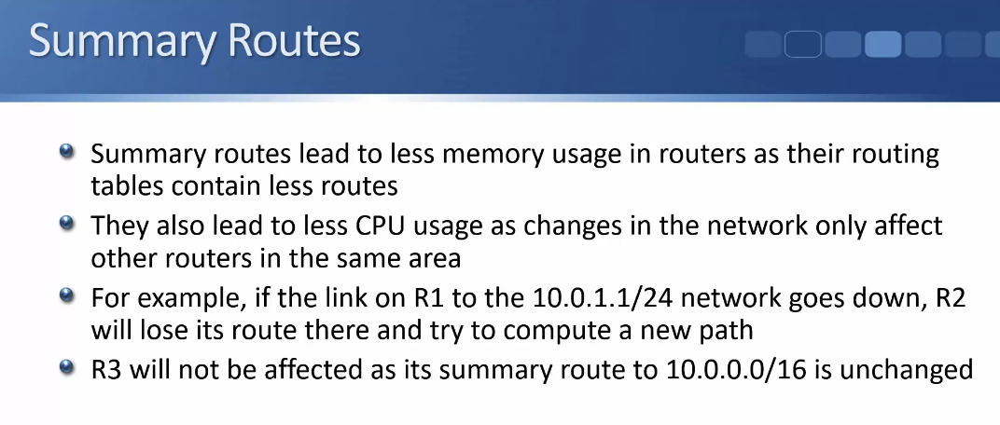

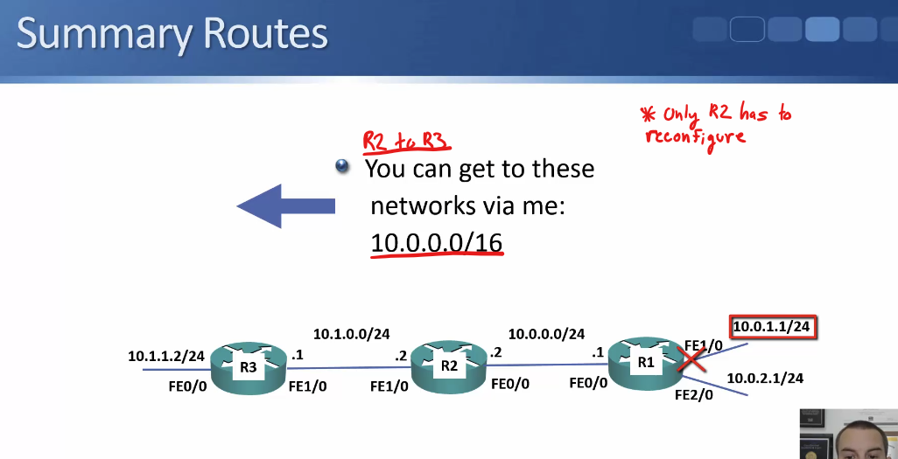

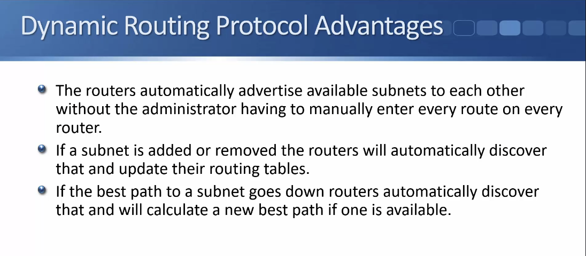

### Dynamic Routing Protocols Lab Demo S17V106

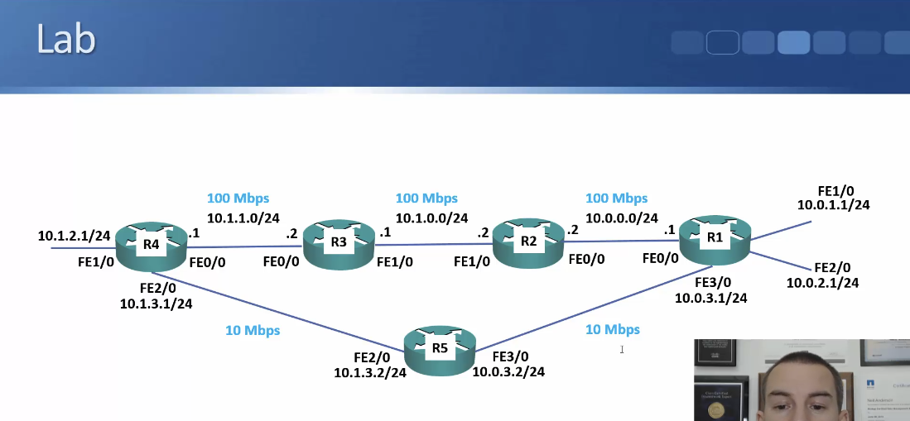

- ^ip addresses already configured on all interfaces

- use notepad and templates to help with configurations

Basic RIP configuration:

    - enable on all interfaces on 10.0.0.0 network

- ^Then do it on all interfaces (R1-R5, example is just R1)

Go to router in middle and start a debug rip (R3):

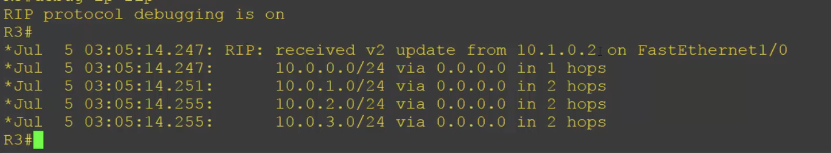

- ^See that rip update is coming in from R2 at 10.1.0.2
- Will also see updates from R4 at 10.1.1.1

- `R3`` should receive updates on  10.0.0.0/24, 10.0.1.1/24, 10.0.3.0/24 and 10.0.2.1/24 networks from `R2`
- R3 will also be sending out updates to R2 and R4

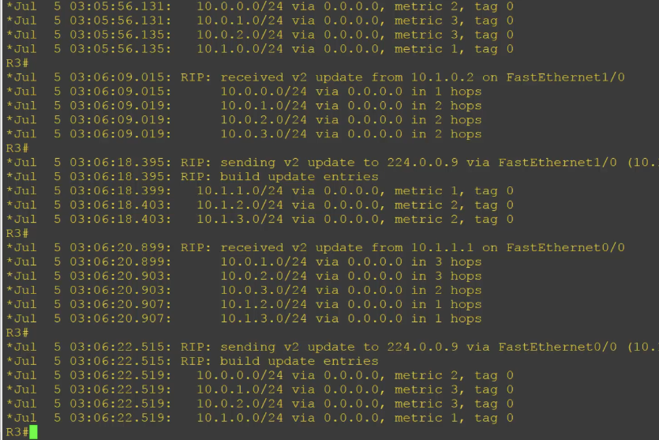

Routing table is updating:

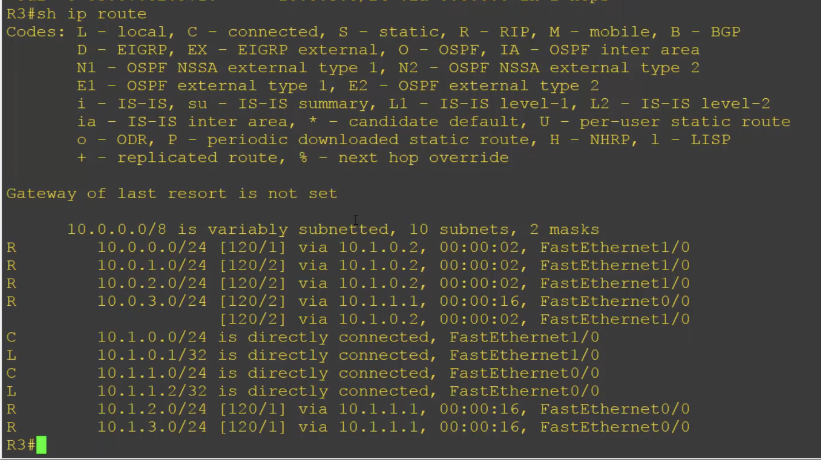

- Turn off debug: `undebug all`

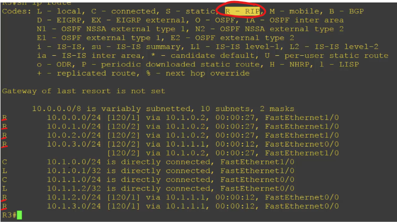

### Routing Protocol Types S17V107

- They both only form adjacency with directly connected neighbors (who they 'talk' to)

- For Distance Vector the updates are from the POV of the neighbor
- For Link State the updates are just all the routers and their links in the network, not the router's POV 
    - routers have full picture of topology and they can make better decisions but put more load on the router

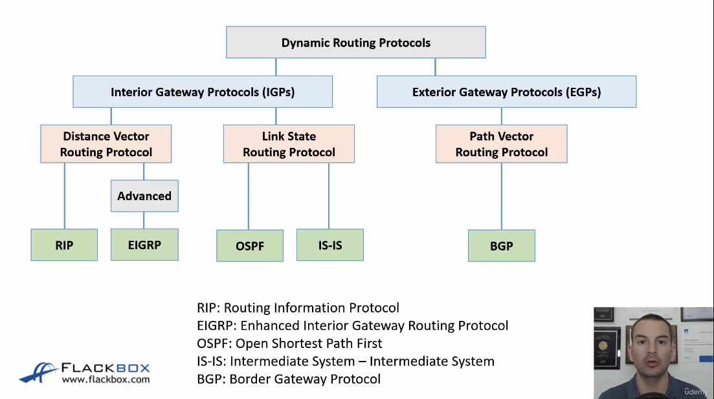

### Routing Protocol Types Demo - S17V108

- We already have RIP configured on all routers 

Command to see what protocols are running: 

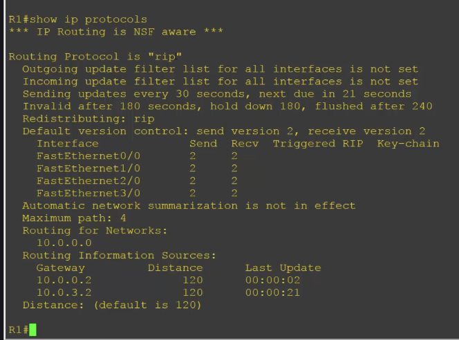

Check Configuration: 

- 'sh run' and scroll or 'sh run | section rip' or 'sh run | begin rip'

show info that was received from rip: 

The 3 Things that happen with Routing Protocols:

1. Routers form an adjacency with eachother
2. exchange routes with eachother
3. Best routes will make it into routing table

- to see best routes check routing table to see which ones made it in 'sh ip route'

- **RIP is a Distance Vector Protocol so we just see the info from neighbors from their POV:

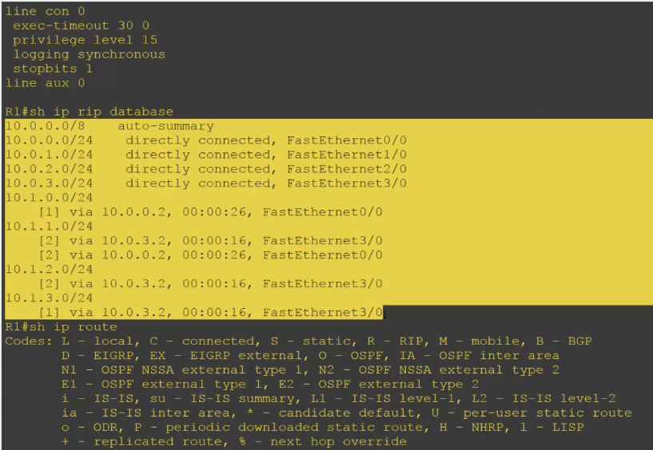

#### COnfiguring OSPF:

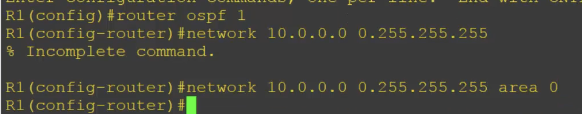

- ^do it on all other routers too

With OSPF we can see the other routers and the link info too (Link State):

### Routing Protocol Metrics - S17V109

#### Metrics For RIP

- IGP - Interior Gateway Protocol

- RIP: Routing information protocol
    - doesn't take link bandwidth into acct.

- R3 tells R4 10.0.1.0/24 3 hops away, R5 is only 2 hops away so it picks R5
    - The one that has the `lowest metric`
    - we would have preferred the top half with 100 megabits per link

#### Metrics for OSPF & Others

- ^OSPF picked top path

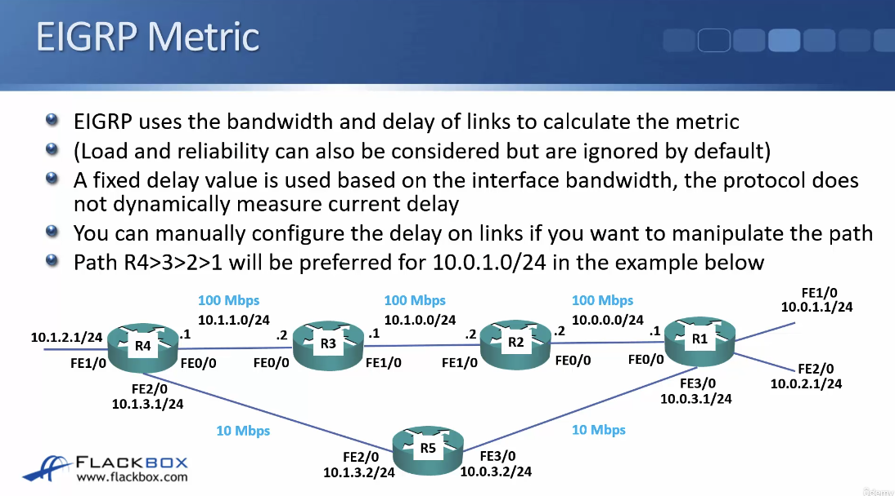

- ^EIGRP is basically like OSPF except u can configure a delay

### Routing Protocols Metrics Lab Demo - S17V110

#### RIP

- ^ips already configured, no routing protocols or static routes configured here

- ^Just connected routes here so definitely no static routes or protocols

1. Paste rip config (highlighted) in on every router:

Rip Routes on R1 verification: 

- Shutdown f3/0 - the routing protocol will reconverge (recalc the next best path):

- Now if you turn it back on it will still take time before rip sees the 'better' path again and moves back to going through R5

#### IS-IS 

- not tested often on CCNA (more common on service provider networks)

Paste it in to every router:

Make sure to change 'net' address every time since every router needs to have a unique net address:

^number 5

- After pasting in IS-IS the IS-IS routes are going to replace the RIP routes in the routing table
    - because of `administrative distance`

- ^It's going along the top path
    - we didn't manually set costs on our links so it behaves like RIP (using hop count b/c links are default same cost)
    - BUT it isn't going along R5 - why?
        - Probably b/c of convergence: R1 has formed adjacency w/ R2 but not with R5 yet
        - When it does learn R5 it will switch to that

- Now going out FE3/0 (like we'd expect for RIP or un-configured IS-IS )

#### OSPF

- Copy & paste OSPF config into each router:

- Again administrative distance has it so OSPF routes replace IS-IS

We have one OSPF adjacency but not all:

Then all: 

- taking bandwidth into account by default

Set links to be lower bandwidth which is why OSPF is preferring top path:

#### EIGRP

- Copy into each router: 

- EIGRP will be chosen over OSPF b/c administrative distance and replace OSPF routes in table 

### Equal Cost Multi Path S17V111

 
- ^R4 will install 2 routes on each path to load balance

Can do the same w/ static (just put in 2+ different next hops):

- IGP same as static for load balancing: 
    - traffic is not going to be load-balanced red-robin style - if you've got a specific host talking to a web server the traffic for that one flow is not going to go through the first packet, R1 then second packet, R2, and so forth
    - If it gets a load balance to R1 all traffic for single flow will go through same router, like R1 for ex

- If you have a different source host talking to a different destination that will be load balanced through a different link

Summary:
    - Same flow always goes through same router
    - different flows go through different routers
    - ** don't want packets for same flow arriving out of order & apps to fail

### Equal Cost Multi Path Lab Demo

- ^have rip and ips configured on all routers

- ^only got one path to 10.0.1.0 because it's a best path

What if we change it so they all have equal costs? :

- first we're gonna leave R5 links slow and add in an R6:

Before R4 just had the 1 route to 10.0.1.0 network behind R1. What happens when we've added in R6?:

- ^Now it's gonna go via **2** paths

Now what happens if we enable OSPF?

- paste in config on all routers: 

- then OSPF routes should replace the rip ones

- ^Now there's just one route again for 10.0.1.0 - why is that?

- OSPF takes bandwidth into account as well as hops so now the 2 routes are not equal anymore.

- To make them equal you have to make the links on R5 100 mgbts too (do it for both interfaces and the ones on R4 and R6)

Now it's converged:

### Administrative Distance S17V113

AD (Administrative Distance) used w/ metrics to determine best path

- ^will work if R3-R4 goes down, but if R3-R2 or R2-R1 goes down R1 will continue sending traffic along the top path and only get as far as the broken link

### Administrative Distance Lab Demo - S17V114

- ^ips are configured, rip is configured for every router except R5

Paste in IS-IS config:

'sh ip protocols' will show rip and IS-IS 
- if you check routing table only IS-IS will show 

- Then do OSPF 
- Then EIGRP

Now Floating Static Route: 

- on R1 is configure a backup route to the 10.1.2.0 network behind R4 to go through R5 instead. 

- would also need a static route from R4, sorry, from R5 to R4, and also static routes coming back in the other direction

It replaced the other one: 

Make it just a backup:

- EIGRP route will be back in routing table now
- static route is in there as a backup now

- you shut down F0/0 EIGRP will detect that and will fail over to the static route we just configured.