## Section 2 - Inter-VLAN Routing

### Router with Separate Interfaces - S22V157

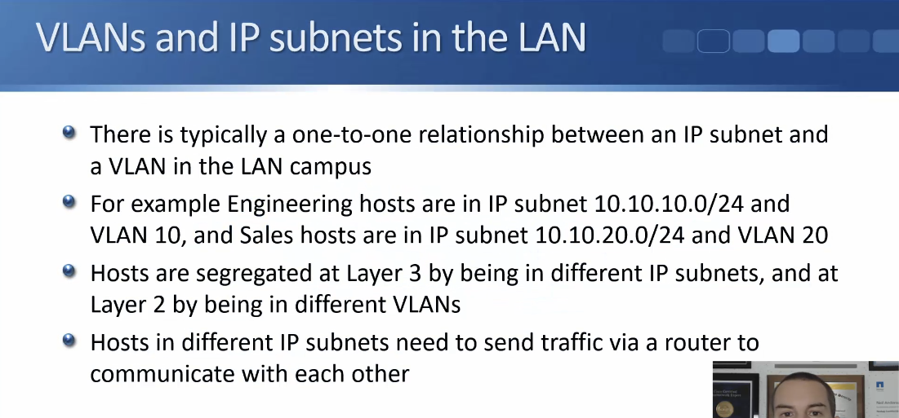

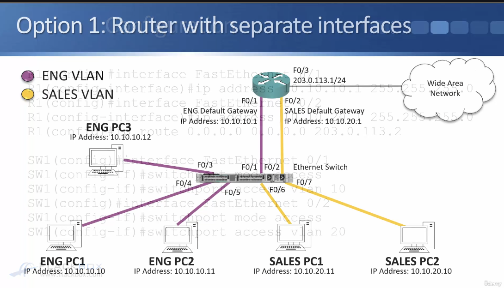

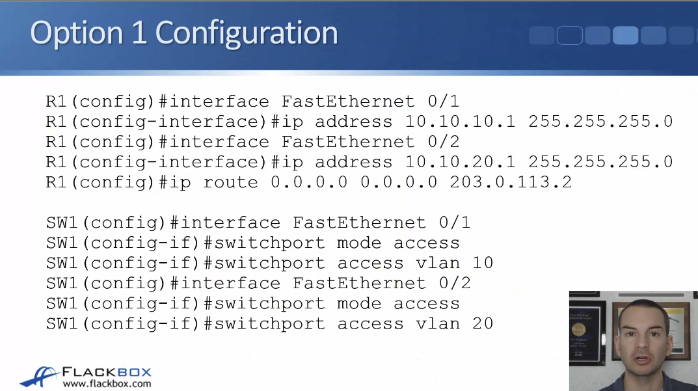

- ^When you're using the router w/ separate interfaces option you just configure it like they're normal end hosts plugged into those ports

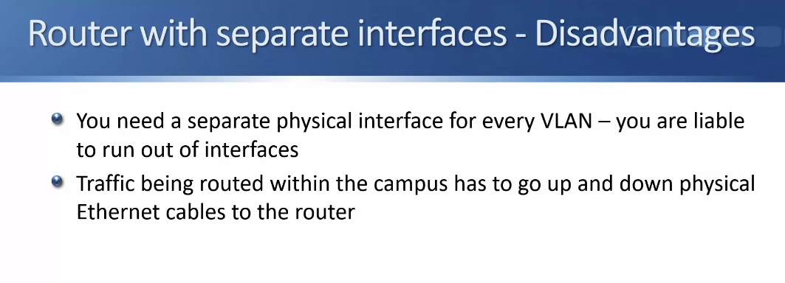

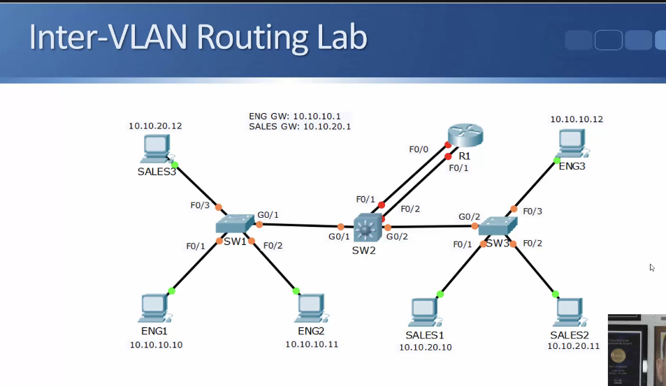

- ^on the router F0/0 will be the Engineering gateway at 10.10.10.1 and F0/1 will be the sales gateway at 10.10.20.1

- All Trunks are configured and all PCs are already in their correct VLANs:

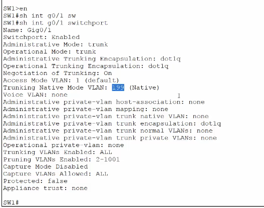

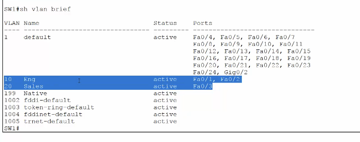

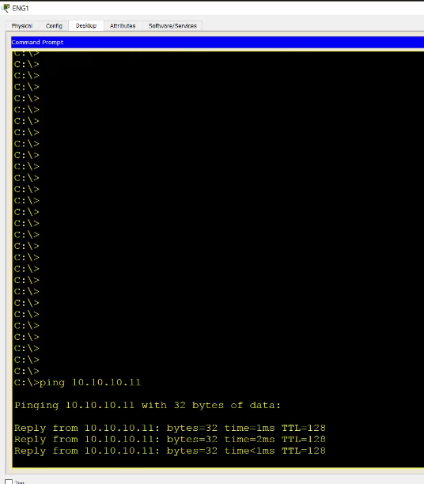

- Eng can't ping sales b/c we haven't configured routing yet.

Configure Layer 3 Routing:

Router first - (configure eng and sales VLANs)

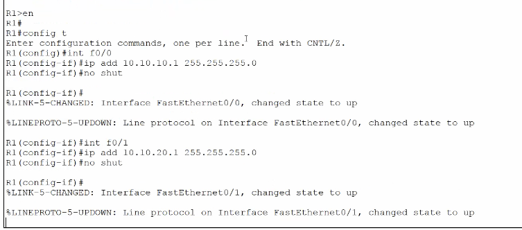

Configure switch w/ matching config:

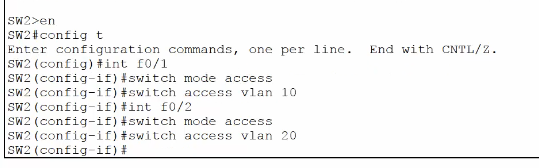

- Now ENG can ping sales

### Router on a Stick - S22V159

`**Most Likely To test on CCNA**`

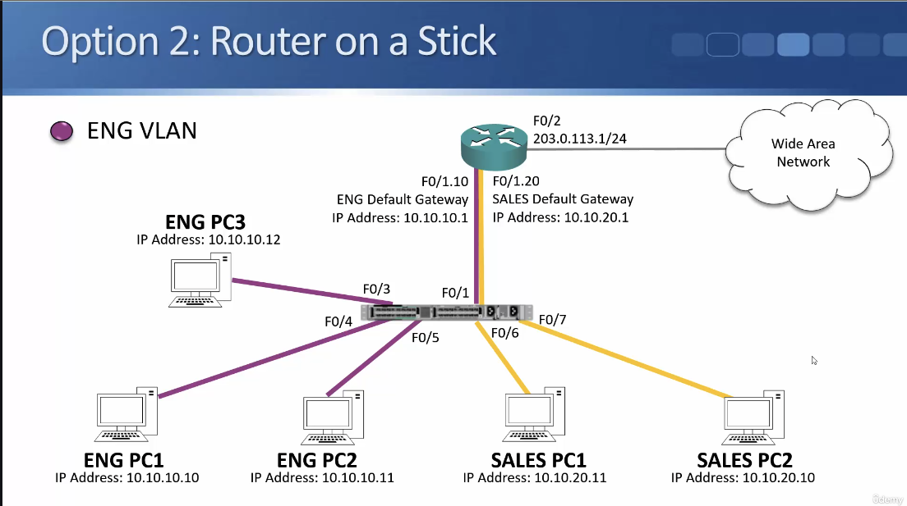

- uses `virtual sub-interfaces` on router that are all on `same physical interface`

- F1/0 is the physical, F1/1.10 and F/1.20 are they virtual sub-interfaces

- If an eng PC wants to send traffic to dif. subnet, will send out an ARP request for MAC address of its default gateway. 
    - switch will forward to everything that's in eng VLAN and it will get sent up F0/1 interface going towards router (F0/1 has been configured as a trunk port)
    - when switch sends it up to router will tag it with 'VLAN 10' so it will hit the 'VLAN 10' sub-interface
    - THEN the router will reply back to the arp request 
    - **gets tagged b/c switch port is configured as a trunk

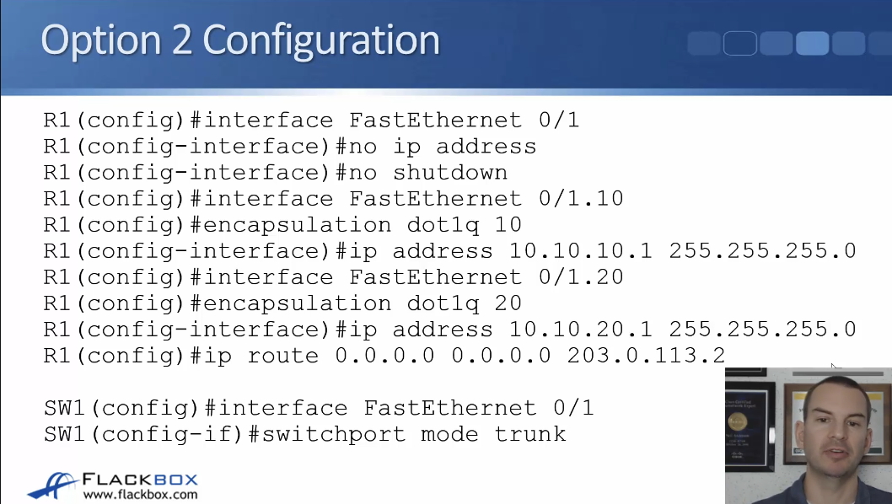

- ^doesn't need an ip address on F 0/1, you put it on the sub-interfaces
    - `encapsulation dot1q` indicates the sub-interface
- we're also connecting to the WAN 

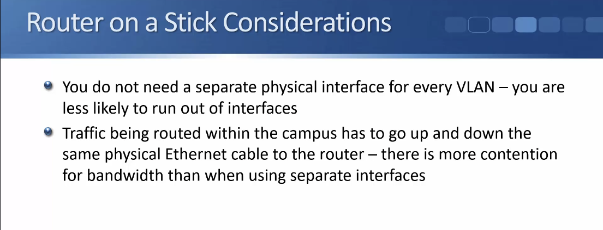

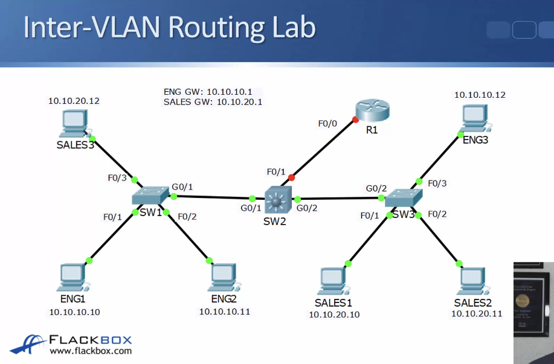

- ^ Configured access ports, trunking, and proper PCs are already in their VLANs

First configure interfaces on router:

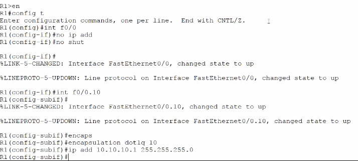
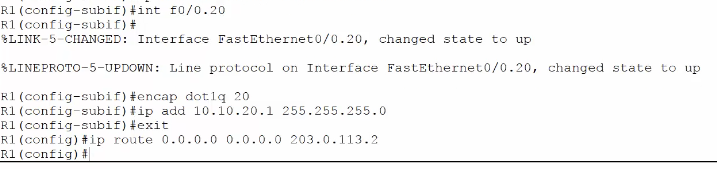

Configure matching config on SW2:

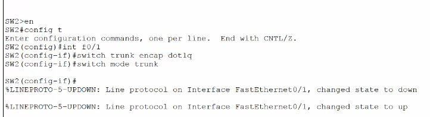

### Layer 3 Switch - S22V160

- Less likely to get tested on CCNA but most common IRL

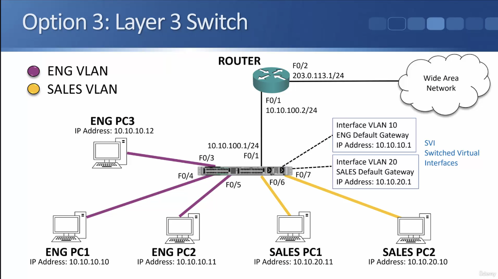

- routing happens on the switch itself

- switch doesn't use physical interface, uses a virtual interface for routing
    - The virtual interfaces act as the default gateways for the PCs

- When a PC sends traffic to L3 switch the access port will have the correct VLAN configured so the switch knows what VLAN the traffic is coming from 
    - Therefore, it knows which SVI will correspond to it

- we also have a router to get to the WAN -> Connections to provider aren't normally gonna be ethernet, L3 switches are ethernet

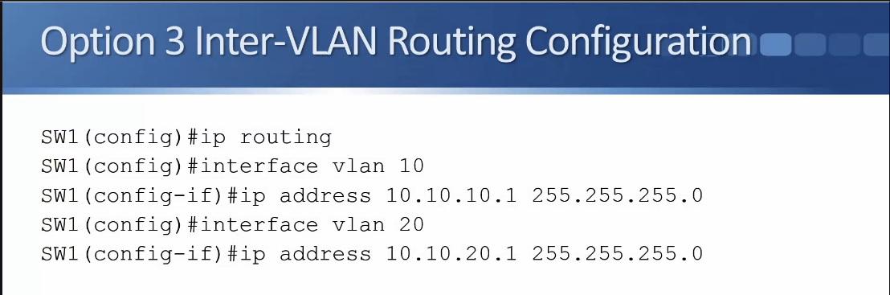

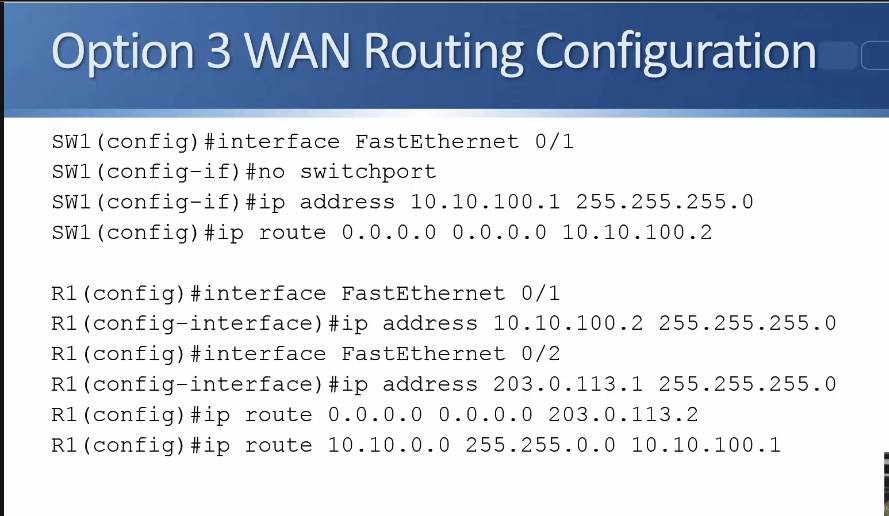

- For configuring F 0/1 (connects to router) need to configure it as a layer 3 interface (has an ip address on the interface itself)
    - put `no switchport` then put the ip address on the interface

- since router isn't directly connected to 10 networks have to explicitly configure the route 

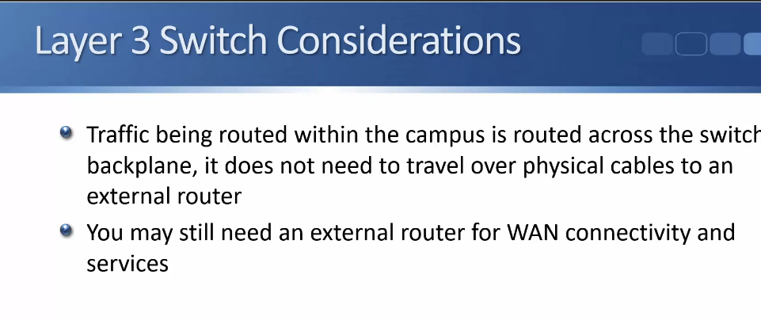

### Layer 3 Switch Lab Demo - S22V161

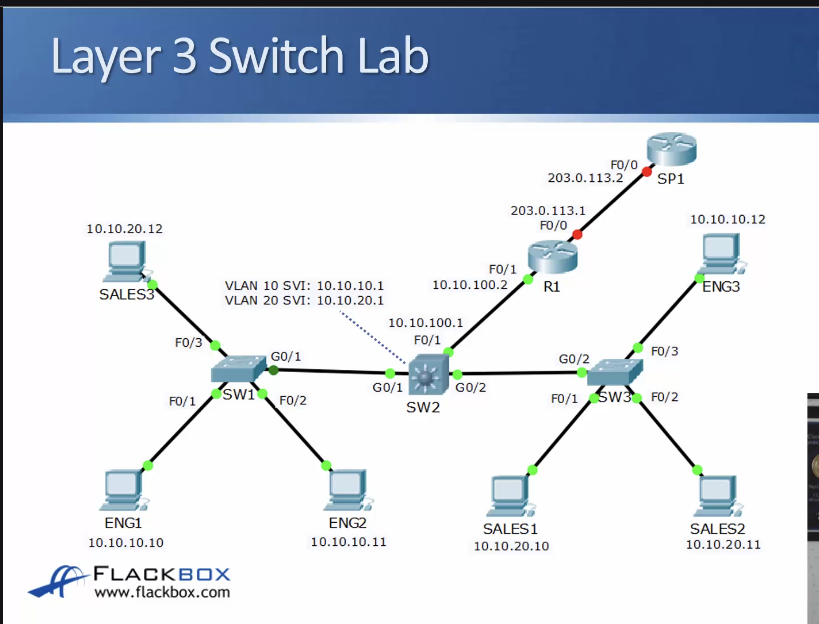

- VLAN trunks, Sales/Eng, Access ports are all configured

Do inter-VLAN routing first: 

SW2 will be Layer 3 switch (SVIs for VLAN 10 and VLAN 20)

1. Enable IP routing:

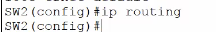

2. Configure SVIs for sales & Eng

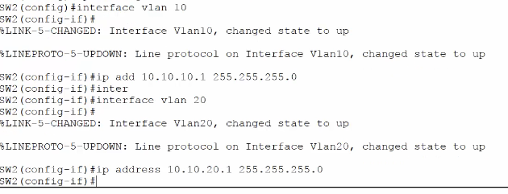

Now we can ping b/t VLANs. 

Set up routes from SW2 to Router 1 and from R1 to service provider:

Convert physical port to a Layer 3 port: 

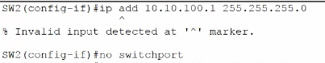

Configure interface:

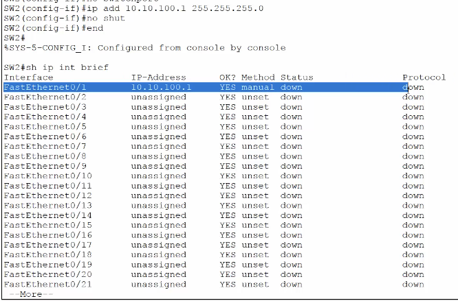

- ^it's down b/c the other side on R1 isn't configured

use F0/0 as outside bc it looks like letter O
use F0/1 as inside bc looks like letter I

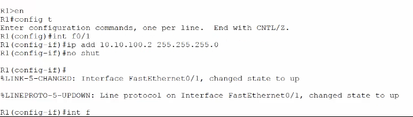

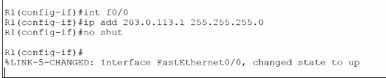

Now we need route on R1 to networks on the inside (10 networks)

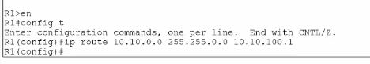

put the route on SW2:

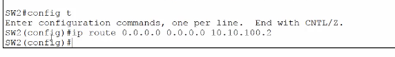

