## Section 28 - ACLs - Access Control Lists

Segmentation:
`Layer 2 - VLANS
Layer 3 - Subnets`

### Access Control Lists Overview - S28V213

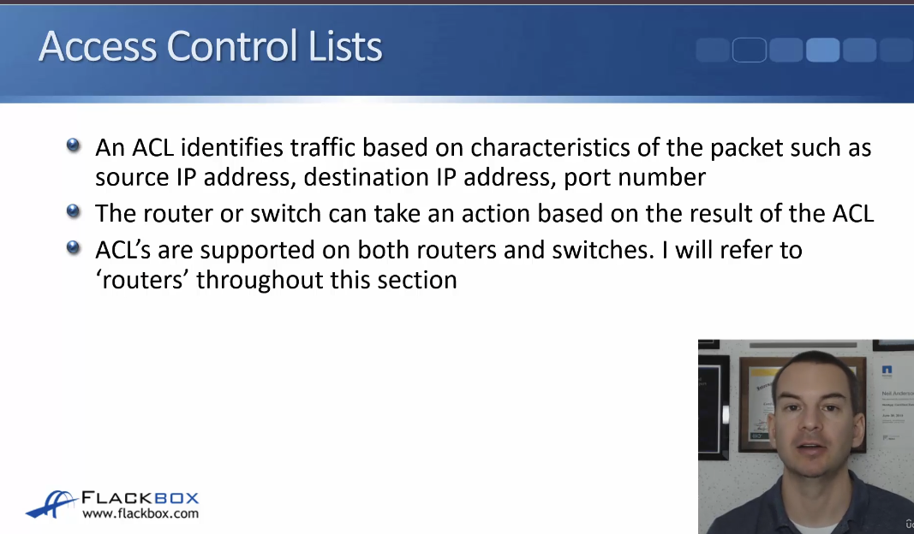

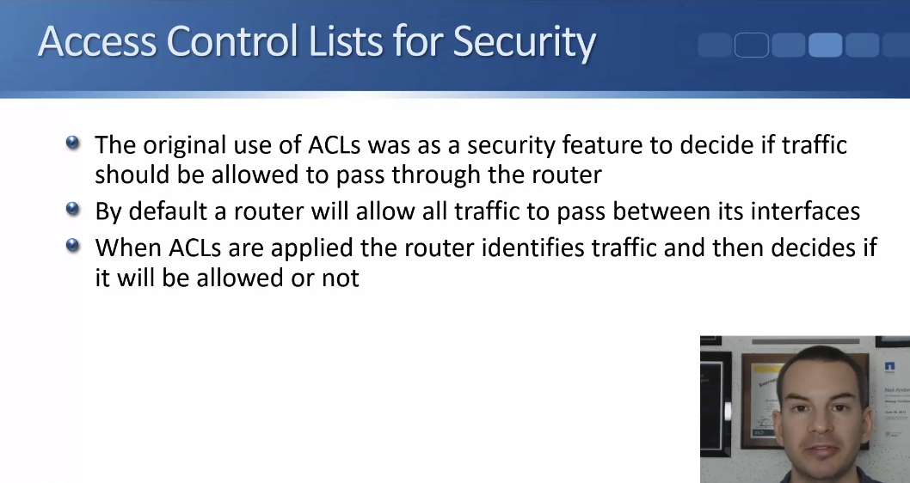

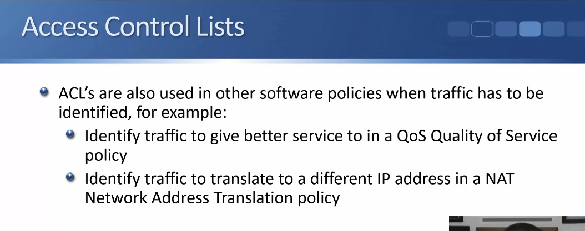

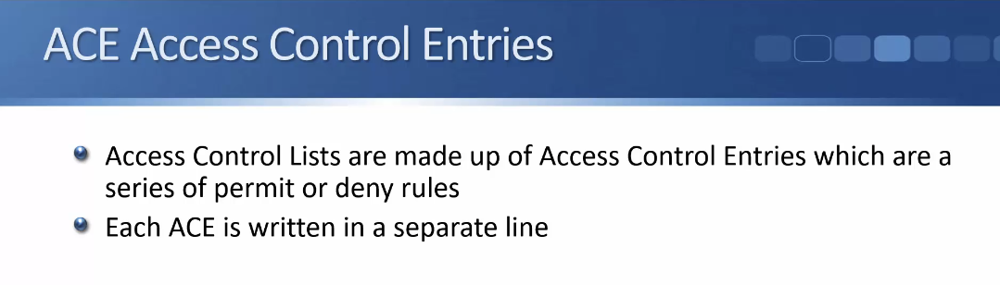

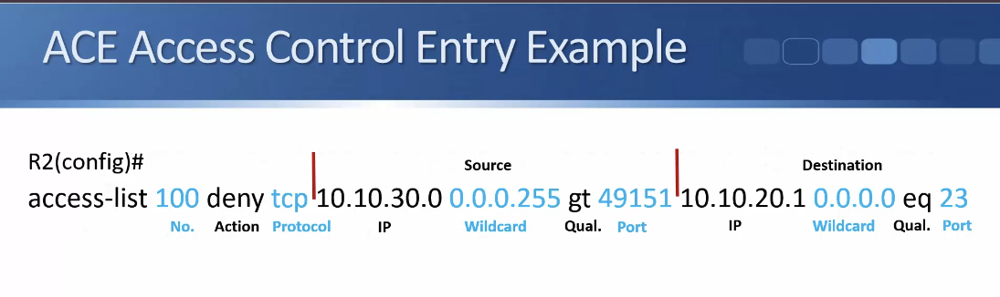

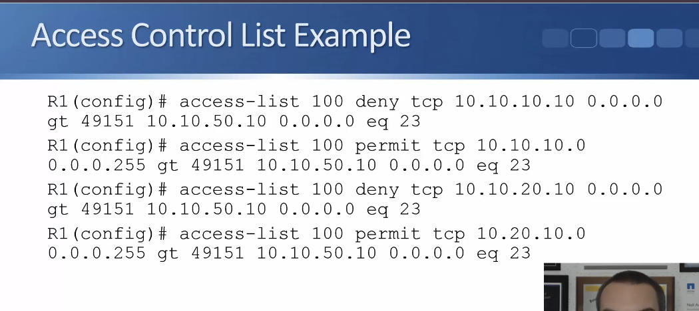

- ^gt is greater than, destination is port 23

### Standard, Extended, and Named ACLs - S28V214

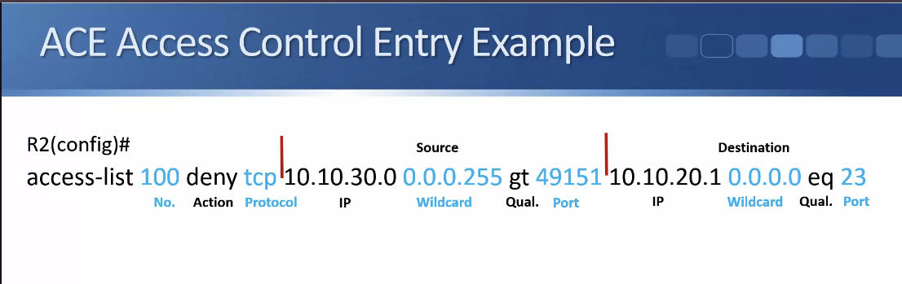

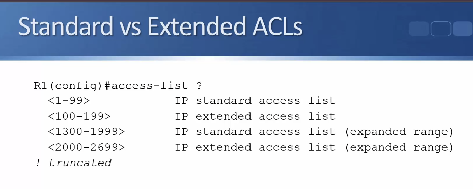

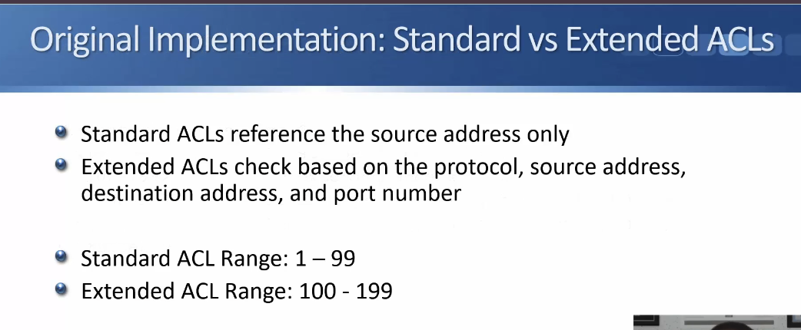

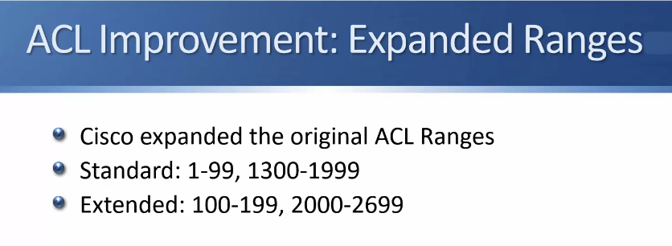

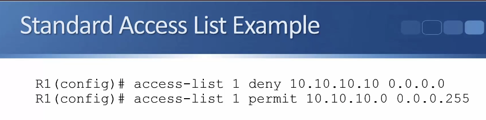

- ^deny 1 host on the network but allow the rest

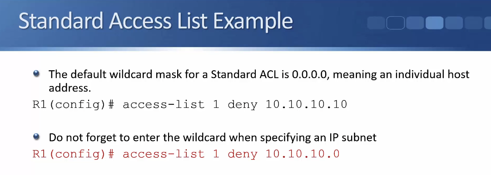

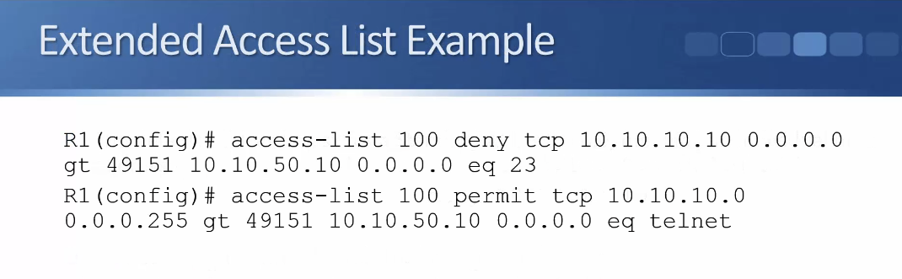

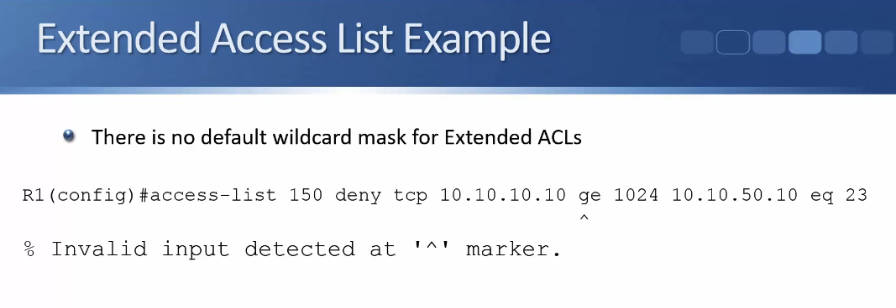

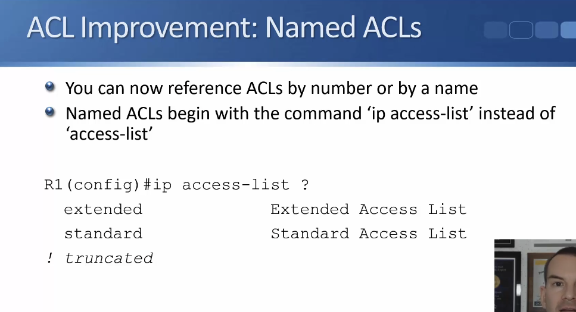

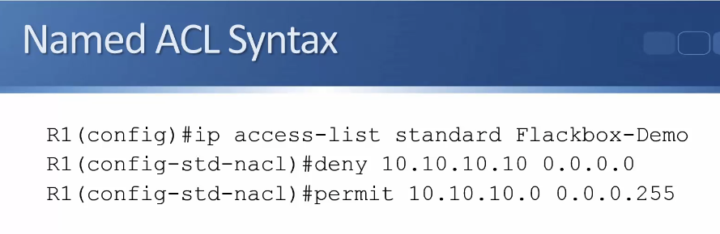

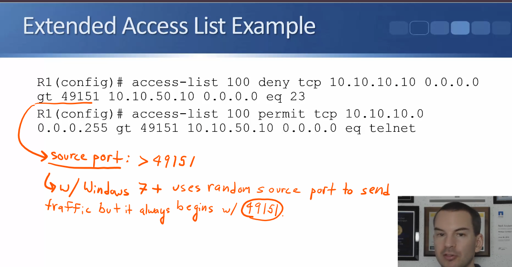

### ACL Syntax - S27V215

