## Section 3 - Host to Host Communications

### Basic Networking Intro S3V14

- Network Characteristics:
    - topology (how its connected)
    - Speed
    - Cost
    - availability: Make sure it's always up, no single points of failure (backup component)
    - scalability: make it easy to grow with company
    - reliability: Will continue to work

### OSI Model (Open Systems Interconnect Model) S3V15 

- This model is a standard of the International Organization for Standardization (ISO)
- layer serves a layer above it and is served by a layer below it.

#### Encapsulation

| Layer | Name | Includes | Devices |
| ----- | ----- | ----- | ----- | 
| 1 | Application | 
| 2 | Presentation |
| 3 | Session | 
| 4 | Transport | TCP/UDP, Port | 
| 5 | Network | IP Addresses | Routers 
| 6 | Data Link | Ethernet MAC Addresses | Switches
| 7 | Physical | | Hubs (not common) |

- `Encapsulation (Sending) goes Top to Bottom`: Layer 7 is encap. by 6, Layer 6 is encap. by 5, etc.
    - Layers 5-7 are the 'Upper Layers' (Not *as* important to network eng)
    - Upper Layer traffic gets encapsulated within Layer 4 header & so on

- `De-Encapsulation (Receiving)` Data is received at Layer 1 and is `opened upwards (Really starts at Layer 3)`
    - L1: Cabled/Wired
    - L2: Check MAC address in layer to see if it's the right receiver, if not discard
    - L3: Check IP in header
    - L4: Look at layer 4 header: Check port num. (For web or email i.e.)
    - L5-L7: etc. 

### TCP/IP Suite/Stack S3V16

- Protocol (set of guidelines on how communication should behave)
- TCP/IP - A protocol stack consisting of many dif. kinds including TCP (Transmission Control Protocol) and IP (internet Protocol)
    - While OSI is conceptual TCP/IP is used to transfer data in production networks.
    - Also layered but doesn't use all OSI even though they are equal (L6-7)

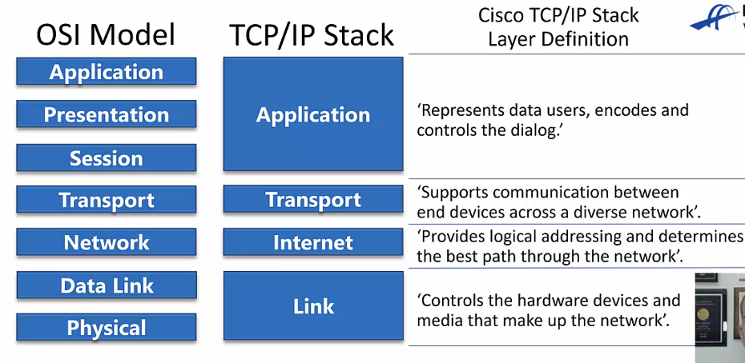    

#### Host Communication Terminology

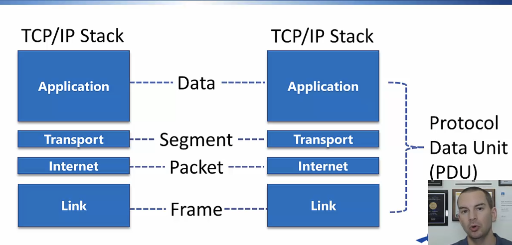

- when 2 hosts talk they are exchanging `PDUs (protocol data units)`
    - PDUs: The entire communication from L7-L1 of OSI
    - Dif terms depend on layer:
        - Application - Data
        - Transport - Segment
        - Internet - Packet
        - Link - Frames 

### OSI Upper Layers S3V17

*CISCO Definitions
- L7 Application Layer 
    - doesn't provide services to any other layers
    - establishes availability of intended communication partners
    - synchronizes & establishes agreement on procedures for error recovery & control of data integrity

- L6 Presentation Layer
    - Makes sure if info from L7 from one device is readable by intended destination
    - "Rosetta Stone" Can translate b/t multiple different data formats using common format (computers w/ dif encoding scheme)

- L5 Session Layer
    - estb, manage, terminate connection b/t 2 hosts
    - also syncs dialog b/t presentation of 2 hosts & manages their data exchange
    - Ex: Web servers have many users, so many communication processes open @ any time to track
    - Also offers efficient data transfer, CoS (Class of Service), exception reporting for upper layer issues

### OSI Lower Layers S3V18

- L4: Transport Layer
    - *Whether TCP or UDP is going to be used and the port #
    - Defines services to segment, transfer, reassemble data for induvidual communication b/t end devices
    - Breaks down large files into smaller segments

- L3: Network Layer
    - *Source & Destination IP is most important
    - Routers operate @ layer 3
    - Provides connectivity & path selection b/t 2 hosts that might be physically distant
    - manages connectivity of hosts by providing logical addressing (IP)

- L2: Data Link Layer
    - *Source and destination layer 2 addresses
    - ex: Source/Destination MAC Address if ethernet
    - swtiches operate @ layer 2
    - Defines how data is formatted for transmission & how access to physical media is controlled
    - also includes error detection/correction 

- L1: Physical Layer
    - *physical network components (cables, etc)
    - enables bit transmission b/t devices
    - defines rules needed for activating/maintaining/deactivating physical link b/t end devices (i.e. voltage levels, physical data rates, max transmission distances, physical connectors, etc)

## Section 4 - IOS Operating System Intro

### CISCO Operating Systems (Bonus Info) S4V20

- Cisco Nexus and MDS data center switch run on NX-OS
- IOS-XR runs on the service provider NCS, CRS, ASR9000, and XR12000 series routers
- IOS-XE runs on ASR1000 series service provider routers
 - CLI interfaces for these others is nearly identical to IOS
 - These new OSs have microkernels so the processes run in separate protected memory address states. If one crashes shouldn't affect the rest
- IOS is monolith so if one processes crashes the whole router crashes

### Connecting to Cisco Device over Network S4V21

- To manage a Cisco device you'll use the CLI and SSH to connect to it's management IP address
- In enterprise, secure login will often be enforced by integration with a centralized AAA (Authentication, Authorization, Accounting) server.
- Telnet is bad b/c unsecured

- PuTTY - 
    - use SSH connection enter IP of router or other device connecting to 

- Out of Band Management: 
     - Production Network: Normal network used by your staff for their everyday activities
    - Management Network: Allows backup path to connect to network devices if production network fails, also helps secure
    - `In Band`: Over production network
    - `Out of Band`: Over management network 

### Make initial Connection to Cisco Device S4V22

- Cisco devices usually don't have a default IP addy so you have to set one up before you can connect to the network
- Need a way to connect to the device to do initial config like adding IP - this is where `Console Connection` comes in.

#### Console Cable (DB9 serial to RJ45 (looks like ethernet))

- Used to be DB9 serial -> laptop and RJ45 -> router
    - need USB to serial adapter since laptops don't have serial ports anymore

- New Console cable: USB -> laptop and mini USB -> router

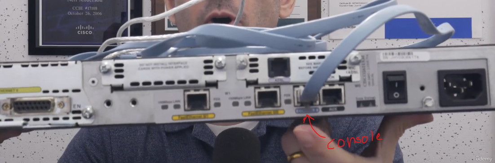

- Use puTTY again
    - Need to use 'serial' type connection this time to connect to console port
    - Need to select the correct COM port on computer
        - Find it by Device Manager -> COM Port -> normally COM3
        - Need to install driver software for cable before you can find it
    - Speed: Go over to more setting for it on the left. Make sure it's connecting to COM3
        - Good settings: Speed=9600, 8 Data bits, 1 stop bit, parity=none, Flow Control=none
   
- Can also use console cable if device's IP becomes unresponsive
- Can also be used to troubleshoot bootup process.
    - Can see device booting up from console connection (not possible w/SSH because system has to already be on for the IP to be active)

### Navigating Cisco IOS Operating System Pt 1 S4V23

(Command Line)

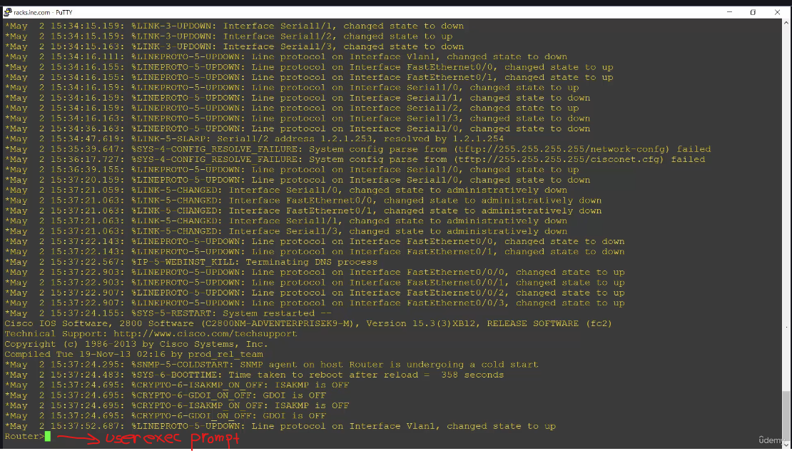
- set scrollback to high number (like maybe 2000)
- enable for privileged exec mode
- Ctrl + c -> break out of command
- Help format: Command ?
- debug: output in real time

#### Actually configure router

- Go to global configuration: C:/>conf t
- **See pdf for rest

### Navigating Cisco IOS Operating System Pt 2 S4V24

*IOS is not case sensitive

- Ctrl + A -> go to start of line
- show and debug commands are entered in privileged exec mode but we tried to put it in in global config.

- Command to `enter privileged exec mode` or `enable mode`:
    - `Router> enable`

- Command to reboot:
    - `Router# reload`

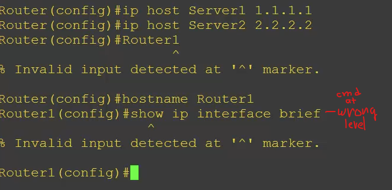
- to get around it put `'do'` at front - makes it work from any level except for enable/privileged exec mode

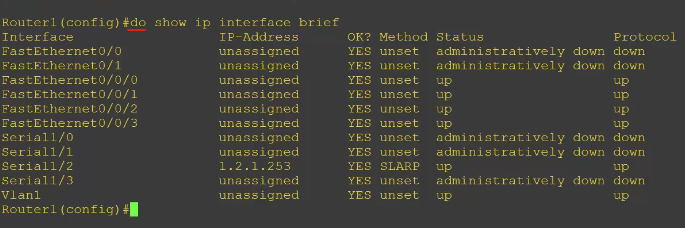

- Global Configuration is for configuring the entire router as a whole. If you need to configure a specific interface you have to go to that level in the cmd hierarchy.

- Command to go to FastEthernet0/0 to do configurations:

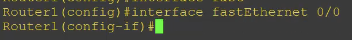

- You have to go up through the levels one by one, which is why this doesn't work
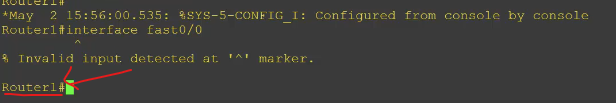

- how to get to global configuration:
    - Router1# `config t`

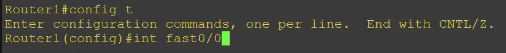

- Router1# -> This is the enable/user exec prompt
- `'end'` - drop all the way back down to the enable prompt

#### Most Common Commands

- `Router1(Config)# do show ip interface brief`
    - will show all IP interfaces on the router, states, and IP address

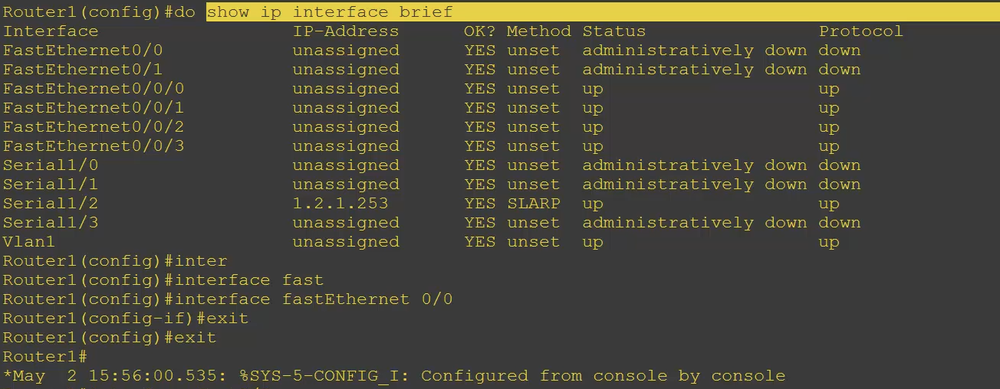

- `Router1(Config)# show running-config`
    - shows entire configuration on router

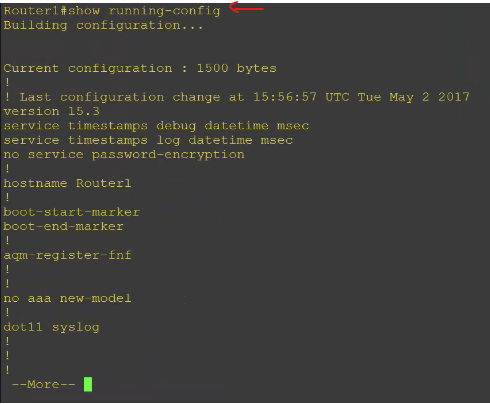

- Can use switches to help narrow down & target what part of the config you want to look at
EX: just show specific interface:

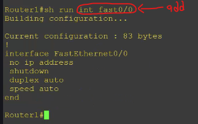

- Others use a pipe (|)

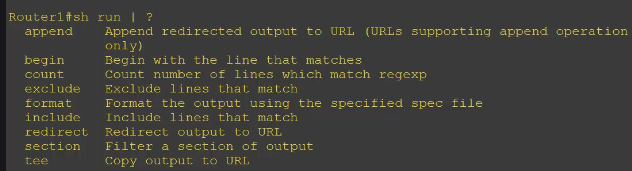

Ex: Show config starting where hostname is:

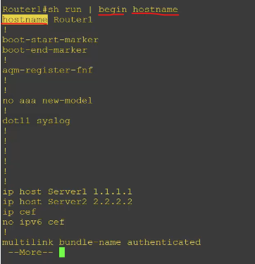

- **Exception to case-insensitive** - regex
    - Here nothing shows up because capital H Hostname is not in the running config:

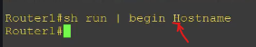

- Shows all the lines that include 'interface':

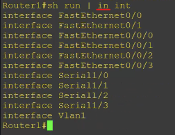

- Shows all lines excluding 'interface':

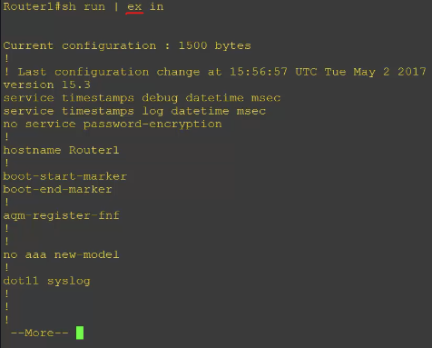

- Shows configuration for all the different interfaces: 

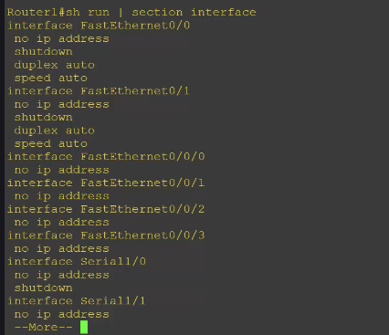

- can do the same with protocols i.e. BGP:
    - `Router1# sh run | section bgp`

### Cisco IOS Configuration Management S4V25

- Change hostname:
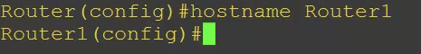

- When you make a change in IOS it shows up immediately and goes/shoes up in the running configuration
- `Starting Config`: Config that goes into effect when the router is next started up. 
    - Changes made in running config aren't permanent until they're also made in the starting config.

- Command to `copy a change from running config to starting config`:
    - Router1# `copy run start`
    - `Have to be at privileged exec mode` 
    - just accept default

- Backup your config:

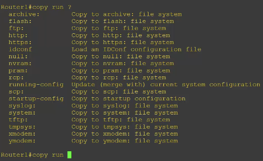

-Now it's backed up

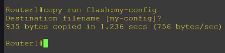

- show it: Router1# show flash
- To restore from this backup, copy it to the startup config and reboot server 
    1. Erase startup config
    2. `copy flash:my-config`
    3. reboot router

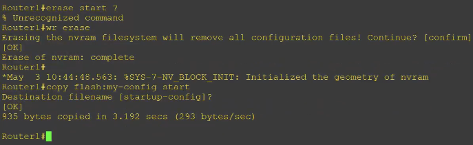

- However, bad idea to backup to the same device cause you can't get it if something goes wrong
- Instead, copy to TFTP server

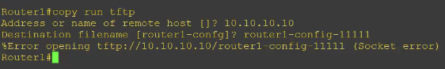

- Check contents (safe to flash)

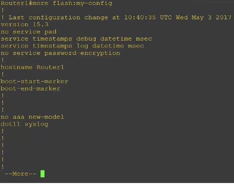

- IOS operating System is stored in Flash
- Startup Configuration is stored in `NVRAM (Non-volatile Random Access Memory` so it's persistent across a reboot)
- Running Configuration is stored in RAM (Loaded into RAM from Startup Config when device boots up)

## Section 5 - OSI Layer 5 - The Transport Layer

### The Transport Layer Header, TCP and UDP S5V28

- Transport Layer
    - provides transfer of data b/t hosts and is responsible for end-to-end error recovery and flow control
        - `flow control` - process of adjusting flow of data from sender to make sure host can handle all of it (This isn't mandatory)
    - `Session multiplexing`: host is able to support multiple sessions at the same time and manage individual traffic streams over a single link. 
    
    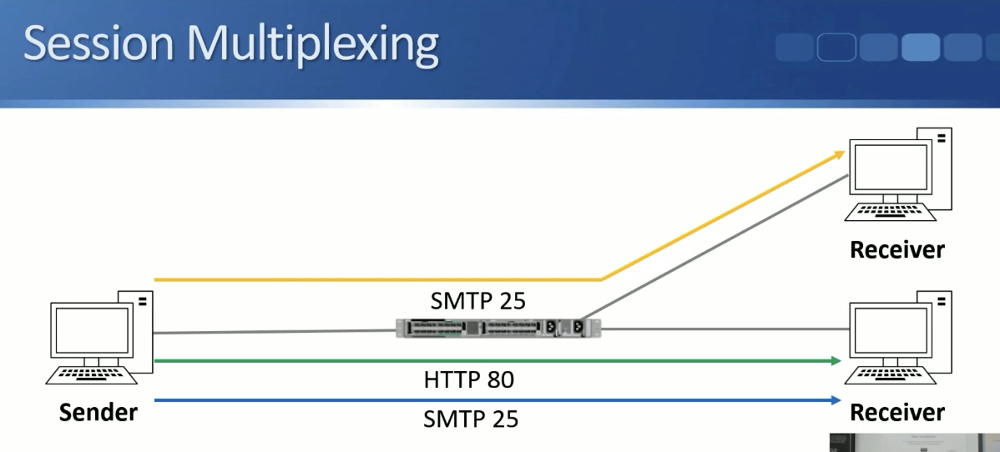

    #### Layer 4 port numbers

    - How does a receiver know what application traffic is for?
        - It knows from the Layer 4 port numbers
        - Layer 4 destination port is used to identify the upper layer protocol
    - HTTP uses port 80, SMTP uses port 25
    - Sender also adds source port number to the layer 4 header
    - Combo of source & destination port numbers can be used to track sessions

    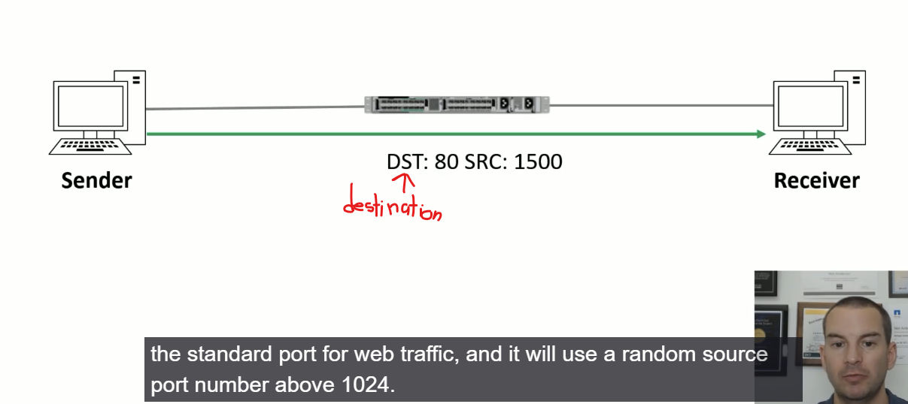

    - When sending traffic back the receiver will flip the numbers around - Port 80 will be the source now and port 1500 will be the destination. (also how stateful firewalls can keep track of connections)

    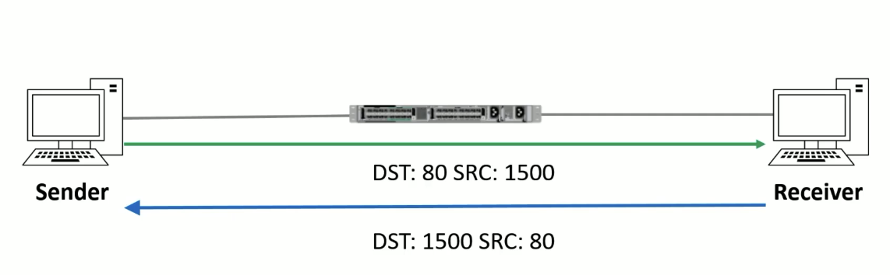

#### TCP

- TCP (Transmission Control Protocol) and UDP (User Datagram Protocol) are the most common layer 4 protocols
    - `TCP is connection oriented`- once a connection is established data can be sent back & forth over said connection
    - TCP does sequencing to make sure segments are put back in right order & none are missing (checks sequence number)
    - TCP is reliable - receiving host sends acknowledgements back to sender, lost segments get resent
    - TCP performs flow control.

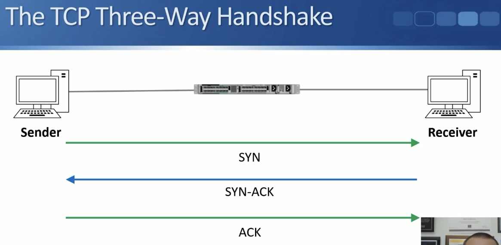

- SYN = Synchronized message

#### TCP Header 