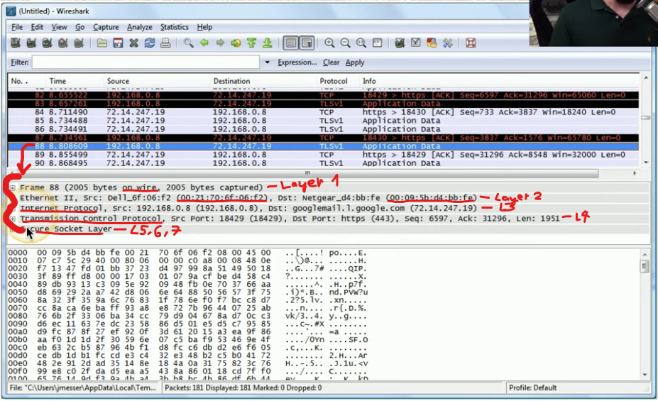
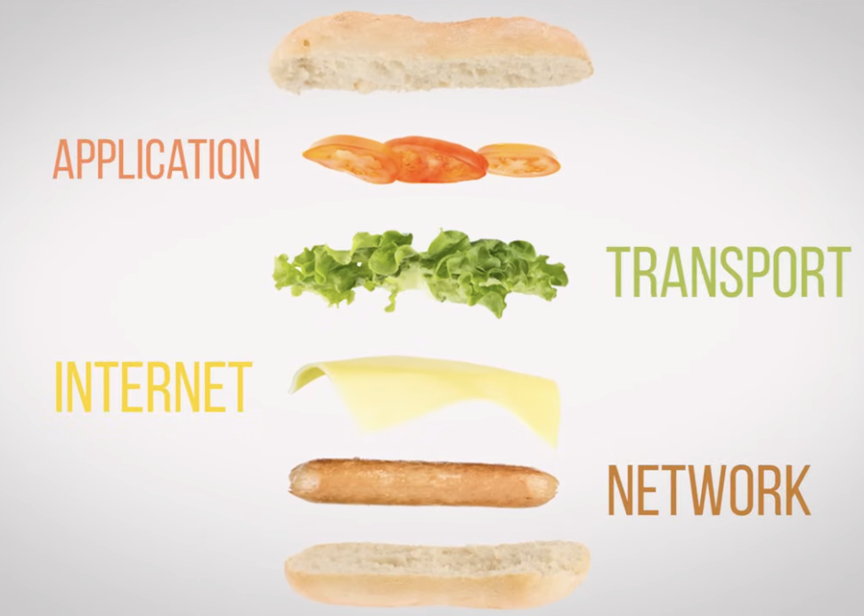

# YouTube Notes - Basics

## OSI Model

### KnowledgeCatch

- OSI: `Open Systems Interconnection`
    - `7 layers`, each handles specific part of data transfer. 

#### Layer 1 - `Physical Layer`

- Hardware, Routers, Wifi, Cables
- Handles actual transmission of data through wires or electromagnetic waves (wireless)
- Need this layer to move data between devices

#### Layer 2 - `Data Link Layer`

- Makes sure data moves smoothly between devices on same network
    - i.e. Make sure data is packaged properly and gets to destination device w/out errors

#### Layer 3 - `Network Layer`

- Works like GPS: Assigns IP address to data and determines best route through network to correct destination

#### Layer 4 - `Transport Layer`

-  'Delivery Truck': Makes sure all pieces of data arrive and in right order. If piece is missing it sends it again

#### Layer 5 - `Session Layer`

- Keeps connection between devices open. 
- Sets up, manages, and closes connection 

#### Layer 6 - `Presentation Layer`

- Encrypts data and transforms it into format both devices can understand

#### Layer 7 - `Application Layer`

- Direct Human interaction: website, email, messaging apps

#### Example

- Send Photo through iMessage to a friend over Wifi
    1. Physical layer: Sent through the Wifi
    2. Data Link Layer: Prepares photo for sending & checks for errors
    3. Network Layer: Assigns friend's IP address to the photo
    4. Transport Layer: Splits photo into smaller packets and makes sure they all arrive to your friend's phone
    5. Session Layer: Keeps Connection open while photo is sent
    6. Presentation Layer: Compresses photo for quicker delivery and safety
    7. Application Layer: Friend opens photo in app

- Troubleshooting/Possible Issues:
    1. Physical - Wifi not working
    2. Data Link - Phone not connected to network
    3. Network - IP address incorrect, etc. 

- Mnemonic (bottom to top): Parrots don't need time, silly parrots attack!
            
            Attack
            Silly
            Parrots
            Time 
            Need
            Don't 
            Parrots 

### Professor Messer 

- OSI Model is a model, broad guideline to describe the way data moves across the network
- There are unique protocols at every layer. 
    - Can be v. different depending on type of traffic going over network.

#### Layer 1 - Physical

- Signaling, cabling, connectors
- *NOT* abt protocols

#### Layer 2 - Data Link Layer or DL Control Layer

- There are a set of protocols called DLC protocols\
    - Ex: On ethernet use `MAC (Media Access Control)` addresses 
        - MAC Addys can also be called '`Layer 2 Addresses` because they correlate back to the DLC protocol
- Also called the `Switching Layer` because switches make their forwarding decisions based off those MAC Addresses
- Frames, MAC Address, Extended Unique Identifier (EUI-48, EUI-64), Switch
- `Frames`: 
        - Block of data made of bits in a sequence that also have control info and error detection codes 

            - Physical Addressing	
            - Source and Destination MAC address
            - Data link layer header + Packet + Trailer	
            - Contains a trailer part
            - Encapsulates a packet

EX:

#### Layer 3 - Network Layer

- Also called the 'routing' layer b/c this layer is associated with IP addresses.
- Fragments `Frames` into smaller pieces to traverse dif. networks.	
- Ex: If you move from Ethernet to WAN back to Ethernet the data is being fragmented at layer 3 to do so
- IP Address, Router, Packet

#### Layer 4 - Transport Layer

- "Post Office Layer" - How and where data is delivered in a system. 
- Protocols used: `TCP (Transmission COntrol Protocol)` and `UDP (User Datagram Protocol)`
    - i.e. You're accessing a really large webpage. All the data can't fit into a single frame so you have to split it up into multiple frames.

#### Layer 5 - Session Layer

- Communication management b/t devices (stop, start, restart)
- `Control protocols`, `tunneling protocols`.

#### Layer 6 - Presentation Layer

- Character Encoding
- Application encryption `(SSL/TLS)`

#### Layer 7 - Application Layer

- What we see i.e. browser
- HTTP, FTP, DNS, POP3

#### Examples

- WireShark

- Google Mail Example

    - Mail will prolly use TCP443 to send, use that protocol for TCP encapsulation at `layer 4 Transport`
    - IP addresses used between your computer and the google mail server, all that communication is happening because of `Layer 3 Network`: IP encapsulation.
    - All TCP and IP traffic is encapsulated in Ethernet frames, and they can be sent over the network because of `Data Link Layer 2`

## TCP/IP

### Techquickie (Linustechtips)

- `TCP/IP`: Transmission Control Protocol and Internet Protocol

    - Application: Apps, HTTP, SMTP, etc.
    - Transport: TCP, UDP
        - UDP is a bit faster and better for low-latency apps like online game

- TCP Header is instructions on how to put pieces back together along w/ error checking

then sent through file network layer -> 

network layer (handles MAC addressing) packets can go to right physical machine and turns into electrical impulses

- Every single packet of data has to go through all these layers. Packet switching makes everything faster than it would be though.

### NetworkChuck-FreeCCNA EP3

- `TCP/IP - Set of guidelines on how computers can communicate` 

- `**** CCNA TIP`: Physical layer of TCP/IP can be divided into 2 parts (physical and data link)

- Layer 2 (Data Link): How hosts on same network can communicate. Uses MAC Addresses

- Layer 3 (Network): IP Address, how to route to right place

#### Difference Between TCP/IP and OSI Models

- Main Difference: Presentation and Session Layers.
    - OSI (Winner): Separate, between Application and Transport 
    - TCP/IP: Extra layers stuffed inside application layer

- Practice:

